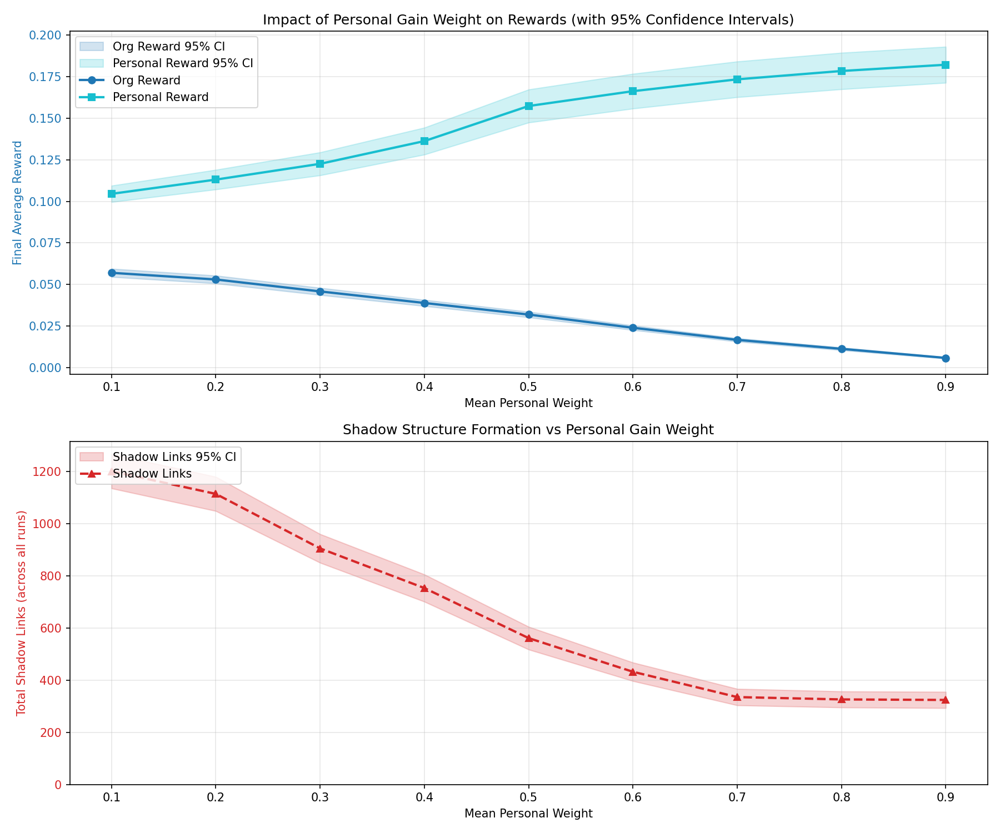
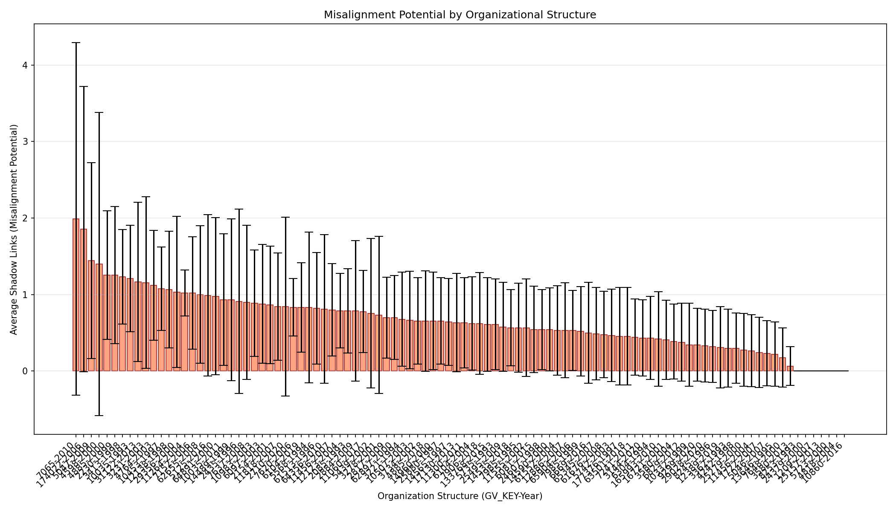

# Org Threat Surface Toy Model

A simulation framework for exploring misaligned AI behavior in organizational social graphs through token-vs-topology trade-offs.

## Overview

This project simulates agents (employees/AI systems) operating within organizational hierarchies. Agents can:
- **Send Emails**: Standard communication following organizational structure (cheap, no topology change)
- **Issue Edicts**: Create direct links bypassing hierarchy (expensive, changes topology)

The simulation explores how misaligned agents (those prioritizing personal gain over organizational goals) restructure organizations by creating "shadow links" that bypass normal communication channels.

### Key Concepts

- **Shadow Links**: Edicts that bypass significant organizational distance (>3 hops), indicating potential misalignment
- **Gain Weights**: Agent preferences balancing organizational, personal, and global objectives
- **Token Budget**: Resource constraint limiting agent actions
- **Learning Dynamics**: Agents adapt their preferences based on reward signals

## Quick Start

1. **Install dependencies**:
   ```bash
   cd Simulations
   uv sync
   ```

2. **Run a quick simulation**:
   ```bash
   uv run main.py --mode single --steps 50
   ```

3. **Explore results with the dashboard**:
   ```bash
   uv run dashboard_server.py
   # Open http://localhost:5000
   ```

## Installation

In order of basedness:

### Use direnv

Install direnv and nix.

Run `direnv allow`.

Use [nix-direnv](https://github.com/nix-community/nix-direnv) for faster shells.

### Use nix develop

Install nix.

Run `nix develop`.

### Use UV directly

Install UV.

Run `uv sync`.

## Running Simulations

### Basic Usage

```bash
cd Simulations
uv run main.py --mode <mode> [options]
```

### Modes

- **`single`**: Run a single simulation
  ```bash
  uv run main.py --mode single --steps 100
  ```

- **`batch`**: Run multiple simulations over sampled organizations
  ```bash
  uv run main.py --mode batch --n-orgs 100 --repeats 10 --steps 100
  ```

- **`sweep`**: Parameter sweep over `mean_personal_weight`
  ```bash
  uv run main.py --mode sweep --n-orgs 100 --repeats 50 --steps 100
  ```

### Key Options

- `--n-orgs N`: Number of organizations to sample (batch/sweep modes)
- `--repeats N`: Number of simulation repeats per organization
- `--steps N`: Number of simulation steps
- `--max-nodes N`: Maximum nodes per organization
- `--mean-personal-weight FLOAT`: Mean personal gain weight (default: 0.3)
- `--data-source {synthetic|snapshot|master}`: Data source for organizations

### Example: Full Sweep Experiment

```bash
uv run main.py --mode sweep \
  --n-orgs 100 \
  --repeats 50 \
  --steps 100 \
  --max-nodes 50 \
  --data-source master
```

This will:
1. Sample 100 organizations from `master_SP500_TMT.csv`
2. Run 50 repeats per organization
3. Sweep `mean_personal_weight` from 0.1 to 0.9
4. Generate results in `results/` directory

## Interactive Dashboard

The dashboard provides an interactive way to explore simulation results.

### Launching the Dashboard

1. **Ensure results exist**:
   ```bash
   ls Simulations/results/
   # Should contain: misalignment_potential.csv, sweep_summary.csv
   ```

2. **Start the server**:
   ```bash
   cd Simulations
   uv run dashboard_server.py
   # or: make dashboard
   ```

3. **Open in browser**: `http://localhost:5000`

### Dashboard Features

- **Sweep Results Visualization**: Interactive charts showing reward dynamics vs. personal weight with confidence intervals
- **Organization Filtering**: Filter and sort organizations by year, misalignment metrics, etc.
- **Network Visualization**: Click any organization to see its network structure with a physics-based force-directed layout
- **Demo-Ready Aesthetics**: Modern, polished UI perfect for presentations

## Results

### Sweep Results: Reward Dynamics

The following plot shows how organizational and personal rewards evolve as we vary the mean personal weight parameter across the population:



This visualization demonstrates:
- **Organizational Reward** (blue): Decreases as personal weight increases, showing how misalignment reduces organizational benefit
- **Personal Reward** (pink): Generally increases with personal weight, though with high variance
- **Confidence Intervals**: Error bars show the uncertainty across multiple simulation runs
- **Shadow Links**: The total number of shadow links created (not shown directly, but tracked in the data)

### Misalignment Potential by Organization

The following plot shows the misalignment potential (average shadow links) for different organizations in the dataset:



This visualization identifies:
- Organizations with high misalignment potential (more shadow links)
- Variation across different firm-years (GV_KEY-Year combinations)
- The distribution of shadow link creation across simulation runs

## Mathematical Model

The simulation models agents making decisions within an organizational hierarchy to maximize a multi-objective utility function.

### Utility Function

Each agent maximizes a weighted utility function:

\[
U = w_{org} \cdot S_{org} + w_{pers} \cdot S_{pers} + w_{glob} \cdot S_{glob}
\]

Where:
- \(w_{org}, w_{pers}, w_{glob}\) are **gain weights** that sum to 1, representing the agent's preferences
- \(S_{org}, S_{pers}, S_{glob}\) are **score components** measuring different objectives

### Score Components

#### Organizational Score (\(S_{org}\))

\[
S_{org}(target) = \text{cosine\_similarity}(\vec{v}_{target}, \vec{v}_{mission}) \cdot \omega_{org}(node)
\]

Where:
- \(\vec{v}_{target}\) is the embedding vector of the target node
- \(\vec{v}_{mission}\) is the organization's mission vector
- \(\omega_{org}(node)\) is a hierarchical weighting function:

\[
\omega_{org}(node) = \frac{\max\_level - node\_level + 1}{N}
\]

This ensures:
- Higher-level nodes (closer to top) receive greater organizational gain
- Scores are normalized by organization size \(N\) (number of nodes)
- Top-level executives derive more benefit from organizational alignment

#### Personal Score (\(S_{pers}\))

\[
S_{pers}(target) = \begin{cases}
\frac{1}{1 + d(target, secret\_target)} & \text{if } secret\_target \text{ exists} \\
0 & \text{otherwise}
\end{cases}
\]

Where \(d(target, secret\_target)\) is the shortest path length in the graph. This incentivizes misaligned agents to move closer to their secret target (a high-centrality deep node in the organization).

#### Global Score (\(S_{glob}\))

\[
S_{glob} = \alpha_{global} \cdot \text{cosine\_similarity}(\vec{v}_{alignment}, \vec{v}_{mission})
\]

Where \(\alpha_{global}\) is a global safety scalar (default 0.5), encouraging alignment with the mission vector.

### Cost Functions

#### Email Cost

\[
C_{email}(source, target) = C_{base} + \phi \cdot C_{distance}(source, target)
\]

Where:
- \(C_{base}\) is the base email cost (default 1.0)
- \(\phi\) is the friction coefficient (default 0.5)
- \(C_{distance}(source, target)\) accounts for path length and direction:

\[
C_{distance} = h_{cost} \cdot \sum_{(u,v) \in path} w(u,v) \cdot \delta(u,v)
\]

With direction factor:
\[
\delta(u,v) = \begin{cases}
0.8 & \text{if going down hierarchy} \\
1.3 & \text{if going up hierarchy} \\
1.0 & \text{if same level}
\end{cases}
\]

This makes downward communication cheaper than upward, reflecting organizational hierarchy.

#### Edict Cost

\[
C_{edict}(source, target) = C_{base\_edict} + 5 \cdot \sum_{n \in bypassed\_nodes} \text{centrality}(n)
\]

Where:
- \(C_{base\_edict}\) is the base edict cost (default 20)
- Bypassed nodes are internal nodes on the shortest existing path
- Centrality is betweenness centrality, measuring how critical a node is to network flow

Edicts are expensive because they bypass organizational structure, and the cost scales with the importance of bypassed nodes.

### Decision Logic

For each agent at each step:

1. **Target Selection**: Find the node \(target^*\) that maximizes utility:
   \[
   target^* = \arg\max_{target \in nodes} U(target)
   \]

2. **Action Selection**:
   - If \(C_{email} \leq tokens\): Prefer email (cheaper, no topology change)
   - Else if \(C_{edict} \leq tokens\) and \(U > \theta_{utility}\): Issue edict
   - Else: No action (insufficient tokens or utility too low)

3. **Misaligned Agent Behavior**: Misaligned agents (with high \(w_{pers}\)) are more willing to issue edicts:
   - Compare efficiency: \(\text{eff}_{email} = U / C_{email}\) vs \(\text{eff}_{edict} = U / C_{edict}\)
   - If previous distance \(> 3\) and \(\text{eff}_{edict} \geq 0.5 \cdot \text{eff}_{email}\): Choose edict
   - This creates "shadow links" that bypass long organizational paths

### Learning Dynamics

Agents update their gain weights using a policy-gradient-style rule:

\[
\vec{w}_{t+1} = \text{normalize}(\text{clip}(\vec{w}_t + \alpha \cdot r \cdot \vec{S}, [0,1]))
\]

Where:
- \(\alpha\) is the learning rate (default 0.05)
- \(r = U - 0.01 \cdot C\) is the reward (utility minus small cost penalty)
- \(\vec{S} = [S_{org}, S_{pers}, S_{glob}]\) is the score vector
- Weights are clipped to \([0,1]\) and renormalized to sum to 1

This allows agent preferences to evolve based on what actions yield rewards.

### Shadow Link Detection

An edict creates a **shadow link** if:
\[
d_{previous}(source, target) > 3
\]

Shadow links represent structural changes that bypass significant organizational distance, indicating potential misalignment.

### Key Parameters

| Parameter | Default | Description |
|-----------|---------|-------------|
| `mean_personal_weight` | 0.3 | Mean of personal gain weight distribution |
| `base_edict_cost` | 20 | Base cost for issuing an edict |
| `friction` | 0.5 | Multiplier for distance-based email costs |
| `token_replenish` | 5 | Tokens added per step |
| `max_tokens` | 100 | Maximum token budget |
| `utility_threshold` | 0.1 | Minimum utility to take action |
| `learning_rate` | 0.05 | Rate for gain weight updates |
| `global_safety_scalar` | 0.5 | Weight for global alignment score |

### Simulation Loop

1. Initialize organization graph \(G\) (synthetic or from real data)
2. Create agents with random gain weights (1-2 misaligned agents with high \(w_{pers}\))
3. For each step:
   - Shuffle agents
   - Each agent executes `decide_action(G)`
   - Deduct tokens, apply topology changes
   - Update gain weights based on rewards
   - Replenish tokens
4. Track metrics: organizational reward, personal reward, shadow links

## Project Structure

```
org-threat-surface/
├── Simulations/
│   ├── main.py              # Main simulation code
│   ├── dashboard_server.py  # Flask server for interactive dashboard
│   ├── dashboard.html       # Dashboard frontend
│   ├── master_SP500_TMT.csv # Real organizational data
│   ├── snapshot.csv         # Sample organizational data
│   ├── results/             # Generated results
│   │   ├── sweep_summary.csv
│   │   ├── misalignment_potential.csv
│   │   └── *.png           # Visualization outputs
│   └── README.md           # Detailed documentation
└── README.md               # This file
```

## Data Sources

The simulation can use three data sources:

1. **Synthetic**: Generated hierarchical organizations
2. **Snapshot**: `snapshot.csv` - Sample organizational data
3. **Master**: `master_SP500_TMT.csv` - Full SP500 TMT dataset (199,656 rows)

Organizations are built from real-world executive data, inferring hierarchy levels from job titles and creating approximate reporting structures.
